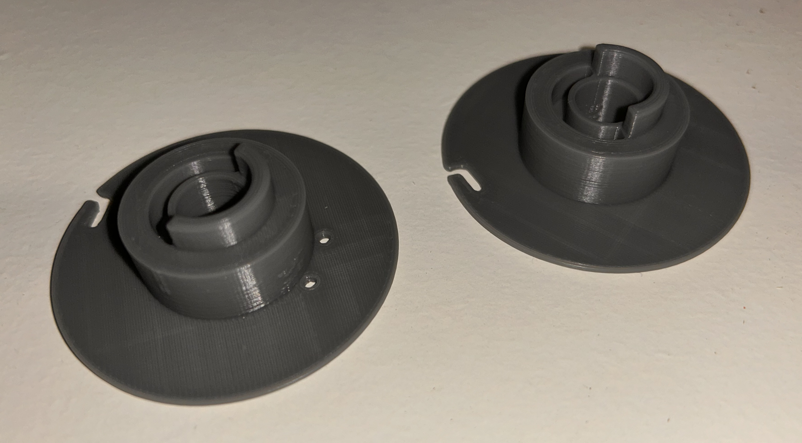
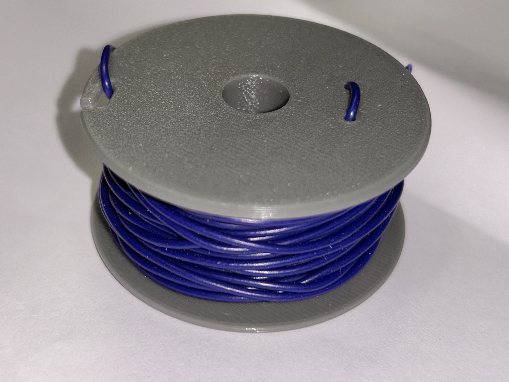

# Wire Spool Holder

This model is a parametrized design for a spool for smaller wires or alike which prints in two identical halfes which can be press-fitted together.

The attached FreeCad file is provided with a few parameters that can help to tweak the design to your needs:

| Parameter   | Description | Default |
| ----------- | ----------- | ------- |
| wheel_dia   | The outer diameter of the spool | 50 mm | 
| inner_dia   | The inner diameter of the spool | 25 mm | 
| rod_dia     | The diameter of the cutout for a rod in the middle | 10 mm |
| base_height | The height (= width) of the inner cylinder (please be aware that the final dimension will be twice that size (due to the two halfes put together) | 10 mm |
| side_height | The height( = width) of the outer wheel | 1.5 mm |
| fit_gap | The tolerance for fitting the two halfes (please adjust this to your printer) | 0.2 mm |

The model is also available on [printables](https://www.printables.com/model/1239671-spools-for-electrical-wire-roles) 

Spool in halfes

Spool assembled and loaded